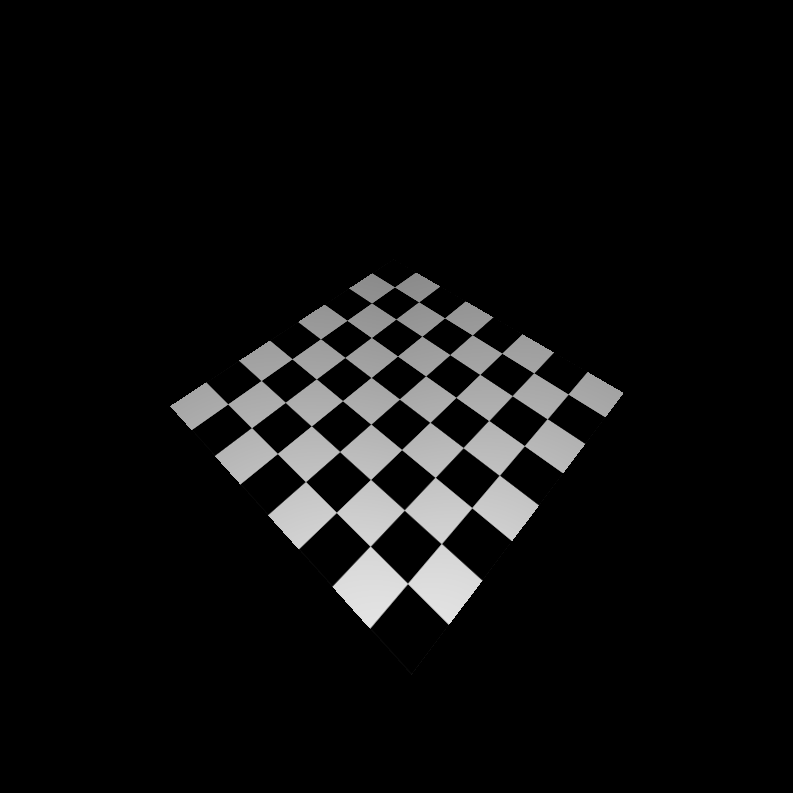

CUDA Rasterizer
===============

**University of Pennsylvania, CIS 565: GPU Programming and Architecture, Project 4**

* Charles Wang
* Tested on: Windows 10, i7-6700K @ 4.00GHz 16GB, GTX 1060 6GB (Personal Computer)

## **Project Overview and Goals**

The goal of this project was to write (most of) the graphics pipeline with CUDA kernels. The project tests ability to understand what OpenGL and other graphics APIs typically do under the hood. There is also continual discussion of the shift from hardware implemented pipeline components vs. software implemented components, so this project is, in a way, an investigation on the software capabilities.

I implemented:
 - Vertex Assembly
    - storing proper information into VertexOut objects after model and camera transformations
 - Rasterization:
    - storing fragments with barycentric interpolation for normals, uvs
- Rendering
    - basically fragment shading.
    - using the stored information to compute lighting (lambert)

### Different Rasterization Modes

I implemented three different rasterization modes: lambert, wireframe and point cloud. They all use the same geometry but provide a slightly different way of presenting the data. 

   |   |   |
|---|---|---|
|  lambert shading with textures  |  triangle wireframe | point cloud   |

### Perspective Correct

Naively using barycentric interpolation for uv coordinates will result in skewing at certain viewing angles. Perspective correct interpolation will remedy this at a small computational cost.

   |   |
|---|---|
|  no perspective correct  |  perspective correct |

### Bilinear Texture Filtering

Casting uv coordinates from floats to ints and fetching texture pixel information directly commonly leads to aliasing issues when the texture is not high resolution.  Bilinear texture filtering is a way of averaging nearby pixels so the resultant texture is more smooth.

   |   |
|---|---|
|  no bilinear filtering  |  bilinear filtering |

### Performance Analysis

Below are charts that describe the compute breakdown of my graphics pipeline.

For some reason, the vertex and primitive assembly takes up a huge chunk of the total render time (I need to further investigate because there's not much complexity in what's been implemented... maybe it's a weird hardware thing)

In any case, the vertex and primitive assembly stages are the same for all configurations of my rasterizer, so maybe it'd be more meaningful to take a look at the rest:

Rasterization is slightly more costly for shaded geometry because we need to find fragments within a bounding box that are inside the triangle, rather than just plotting the lines or points. Textured geometry will also take more time to rasterize because we need to find the perspective correct interpolated values for the UVs.

Fragment shading for shaded geometry is also significantly slower because we need to calculate lambertian shading and fetch texture data rather than just passing through the fragment color. Intrducing bilinear texture filtering also slows down the process because each fragment color requires multiple texture pixel accesses.

### Credits

* [tinygltfloader](https://github.com/syoyo/tinygltfloader) by [@soyoyo](https://github.com/syoyo)
* [glTF Sample Models](https://github.com/KhronosGroup/glTF/blob/master/sampleModels/README.md)
